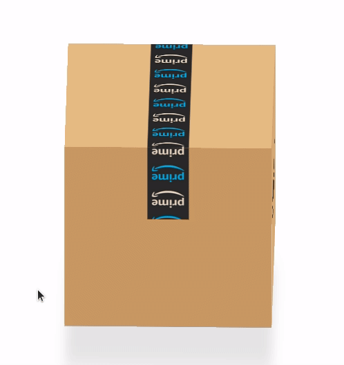

# av-amazon-box-css

* 클론코딩
* 아마존박스를 css로 반들고, js로 인터렉션 하기
* [Online Tutorials - CSS Only Animation Effect + 360 degree Amazon Card Box view on Mousemove](https://www.youtube.com/watch?v=7UJ7J1lM2Bw&t=75s)

## 결과물

## 노트
* background-size
* background-position
* background-position-x
* `background: #111 url(...);` 동시사용
* querySelector, getElementById
* `transform: rotateX(90deg) translate3d(0, 0, 150px);`
* `transform-style: preserve-3d;`
* `filter: blur(15px);`
